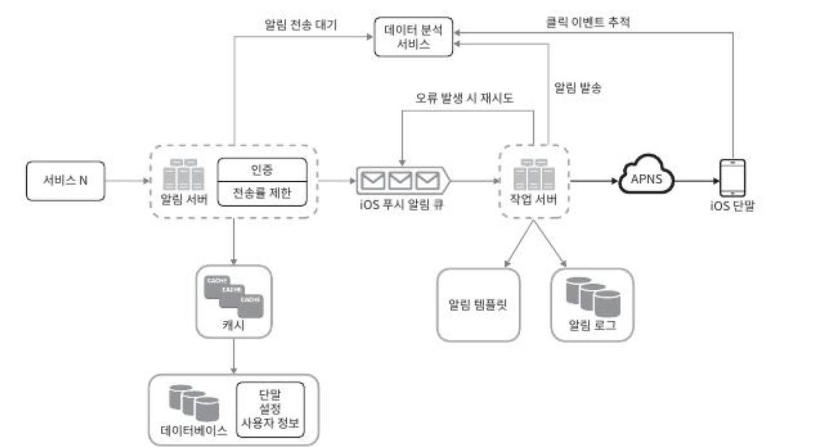
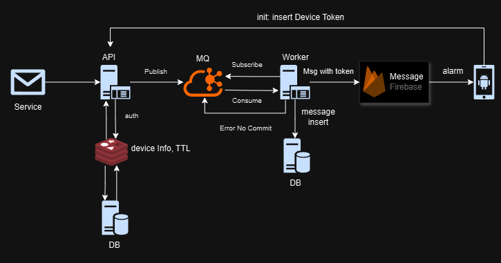

# [가상 면접 사례로 배우는 대규모 시스템 설계 기초](https://www.yes24.com/Product/Goods/102819435)
저자: 알렉스쉬

---

# 10장 알림 시스템 설계

## 단말기 별 푸시 알림
- iOS: APNS(Apple Push Notification Service)
- 안드로이드: FCM(Firebase Cloud Messaging)
- SMS: 트월리오(Twilio), 넥스모(Nexmo) 등등
- 이메일: 고유의 이메일 서버, 센드그리드(Sendgrid), 메일침프(Mailchimp)

## 요구사항

- 푸시알림, SMS 메세지, 이메일
- iOS ,안드로이드, 랩톱/데스크톱 지원
- 사용자가 받지 않게 설정 가능
- 하루에 천만건의 모바일 푸시 알림, 백만건의 SMS 메시지, 5백만 건의 이메일

## 연락처 저장 테이블
- TABLE: user
    - user_id : bigint
    - email: varchar
    - country_code: integer4
    - phone_number: integer
    - created_art: timestamp
- TABLE: device
    - id: bigint
    - device_token: varchar
    - user_id: bigint
    - last_logged_in_at: timestamp
- TABLE: message
  - id: bigint
  - user_id: bigint
  - send_time: timestamp
  - contents: text
  - receiver: bigint

## 계락적 설계안

- 데이터베이스와 캐시를 알림 시스템의 주 서버에서 분리한다.
- 알림 서버를 증설하고 자동으로 수평적 규모 확장이 이루어질 수 있도록 한다.
- 메시지 큐를 이용해 시스템 컴포넌트 사이의 강한 결합을 끊는다.

## 작업 흐름

1. API를 호출하여 알림 서버로 알림을 보낸다.
2. 알림 서버는 사용자 정보, 단말 토큰, 알림 설정 같은 메타데이터를 캐시나 데이터베이스에서 가져온다.
3. 알림 서버는 전송할 알림에 맞는 이벤트를 만들어서 해당 이벤트를 위한 큐에 넣는다. 가령 iOS 알림 이벤트는 iOS 푸시 알람 큐에 넣어야 한다.
4. 작업 서버는 메시지 큐에서 알림 이벤트를 꺼낸다.
5. 작업 서버는 알림을 제3자 서비스로 보낸다.
6. 제3자 서비스는 사용자 단말로 알림을 전송한다.

## 상세 설계
- 안정성
    - 데이터 손실 방지
        - 데이터를 데이터베이스에 보관하고 재시도 메커니즘을 구현해야한다.
        - 알림 로그 데이터베이스를 유지하는것이 한가지 방법이다.
    - 알림 중복 전송 방지
        - 보내야 할 알림이 도착하면 이벤트ID를 검사하여 이전에 본적이 있는 이벤트인지 살핀다. 중복된 이벤트면 버리고 그렇지 않으면 알림을 발송한다.
- 추가로 필요한 컴포넌트 및 고려사항
    - 알림 템플릿
    - 사용자 별 알림 설정
    - 전송률 제한
    - 재시도 방법
    - API키 보안
    - 큐 모니터링
    - 이벤트 추적
    

---

## 실행 방법
---

# Result
- 전송률 제한은 redis에 토큰 TTL을 이용해서 1분동안 유지되는 값을 입력, 메세지를 보낼때 마다 토큰 별로 갯수 증가, 1분 동안 300개 이상의 값을 보내면 오류 출력
- MQ는 kafka의 Topic 을 만들어서 사용한다.
- 작업서버에서 전송 오류시 MQ로 conmmit 을 보내지 않음으로 재전송을 시도한다.
- 안드로이는 Flutter 로 작업 FireBase 를 알림서비스로 사용
- 안드로이드는 최초 앱 실행시 자신의 firebase Token값을 API 에 post로 전송하여 데이터를 저장한다.

## Alarm Architecture

