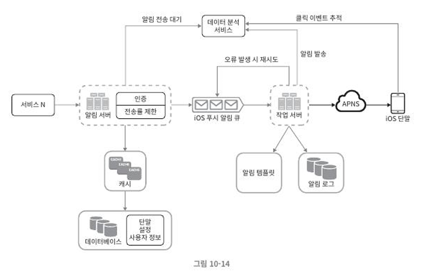
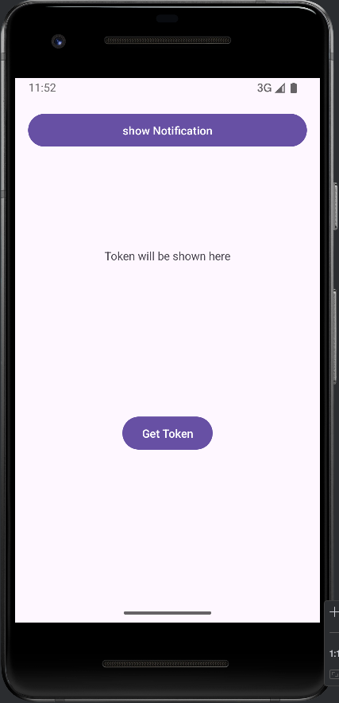
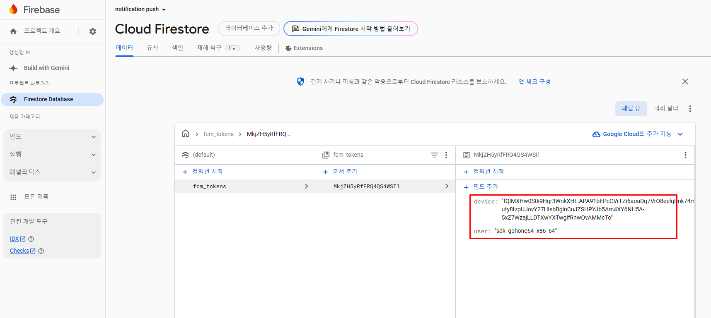
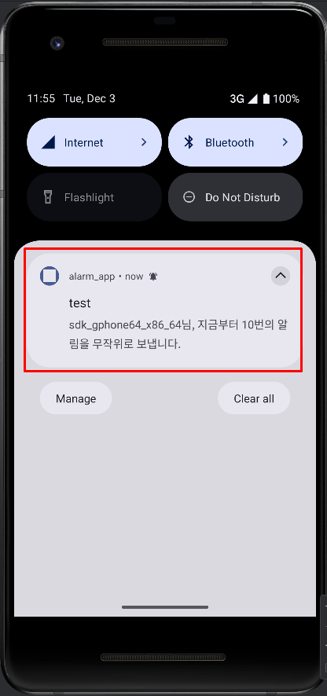
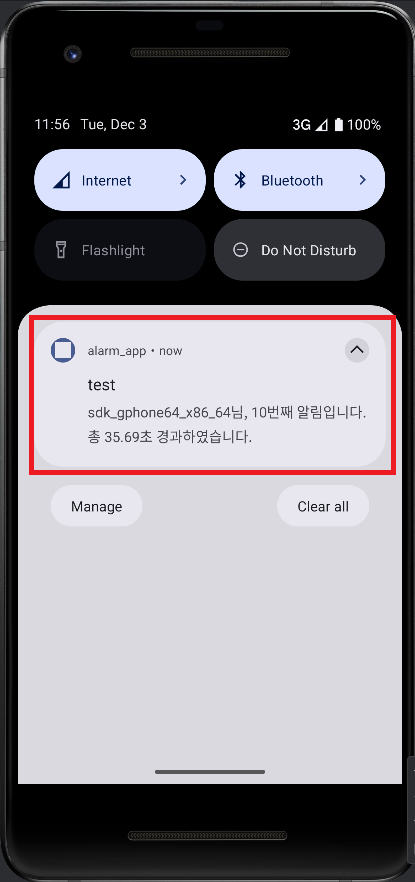

# [가상 면접 사례로 배우는 대규모 시스템 설계 기초](https://www.yes24.com/Product/Goods/102819435)
저자: 알렉스쉬

---

# 10장 알림 시스템 설계

## 개략적 설계안

- 알림 유형별 지원 방안
- 연락처 정보 수집 절차
- 알림 전송 및 수신 절차

## 알림 유형별 지원 방안

### IOS 푸시 알림
  
- 알림 제공자는 단말 토큰과 페이로드 값을 APNS(Apple Push Notification Service)에 요청하면 APNS는 IOS 단말로 알림을 보냄
  
### 안드로이드 푸시 알림
  
- IOS와 유사하게 진행되며 APNS 대신 FCM(Firebase Cloud Messaging) 사용
  
### SMS 메시지
  
- 트윌리오, 넥스모 등의 상용 서비스 이용(유료)
  
### 이메일
  
- 개인 이메일 서버 또는 제3자의 서비스 이용

## 연락처 정보 수집 절차

1. 사용자의 앱 설치 또는 계정 등록
2. API로 사용자 정보 수집
3. `user`와 `device` 테이블로 구성된 DB에 저장

## 알림 전송 및 수신 절차

1. 서비스는 알림 시스템으로 API 요청
2. 캐시 또는 DB에 저장된 사용자 및 단말 정보 검증
3. 메시지 큐에 알림 전송
4. 작업 서버는 메시지큐에서 전달 받은 알림을 제3자 제공 서비스(APNS, FCM, …)로 다시 전달
5. 제3자 서비스는 사용자 단말로 알림 전송

## 상세 설계

### 안정성

- 데이터 손실 방지을 위해 알림 로그 DB 사용 가능
- 알림 중복 전송 방지를 위해 중복 탐지

### 추가로 필요한 컴포넌트 및 고려사항
    
- 알림 템플릿을 정해 알림 형식을 일관성 있게 생성
- 알림 설정을 사용자가 변경할 수 있도록 설계
- 전송률 제한으로 알림 설정을 유지할 수 있도록 설계
- 알림 실패 시 재시도
- 보안을 위해 인증 승인된 사용자만 푸시 알림
- 큐 모니터링으로 큐에 얼마나 쌓이는지 확인
- 알림 확인율, 클릭율 등의 이벤트 추적

### 수정된 설계안

## 마무리

- 중요 정보를 계속 알려주기 위해 알림은 필수 요소임
- 컴포넌트 사이 결합도를 낮추기 위해서는 메시지 큐를 적극적으로 사용해야 함
- 알림 전송 최적화를 위해 아래의 조건을 만족 해야함
  - 안전성 향상
  - 보안
  - 이벤트 추적 및 모니터링
  - 사용자 설정
  - 전송률 제한

---

# Result

## Notification Architecture

## Android

## Database

### Alarm

